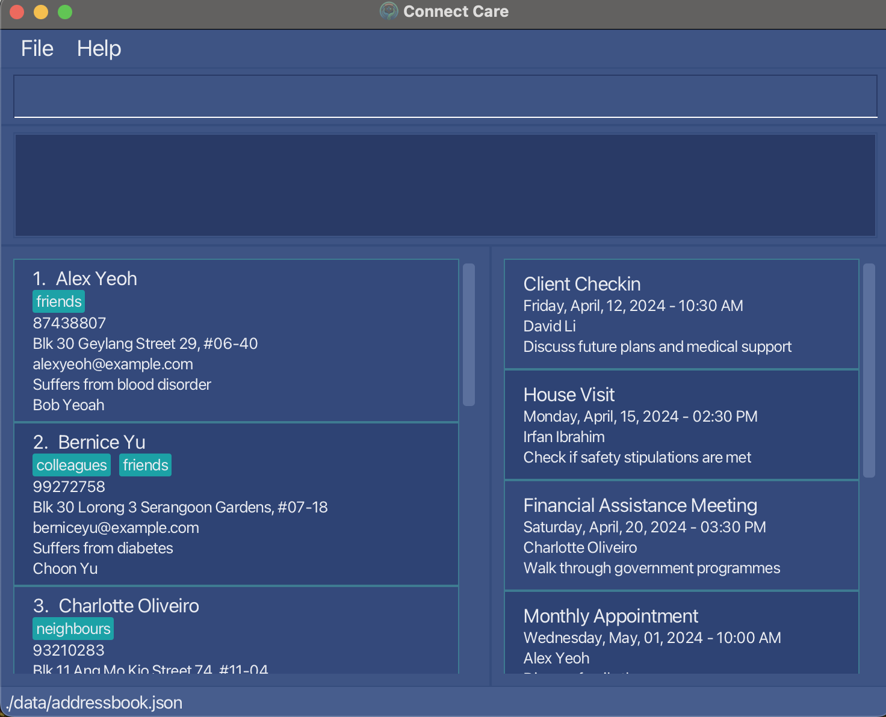

# Welcome to ConnectCare

Welcome to ConnectCare, a comprehensive platform designed to empower
social workers in delivering personalized care and support to their clients. 
ConnectCare streamlines the process of managing client information, and 
scheduling appointments, allowing social workers to focus on what matters
most – providing high-quality care.

### Key Features:

- **Client Management:** Easily manage client information, including next of kin details, contact details, and descriptions, all in one secure location.
- **Appointment Scheduling:** Schedule appointments easily with clients.

**Acknowledgements**

* Libraries used: [JavaFX](https://openjfx.io/), [Jackson](https://github.com/FasterXML/jackson), [JUnit5](https://github.com/junit-team/junit5)
